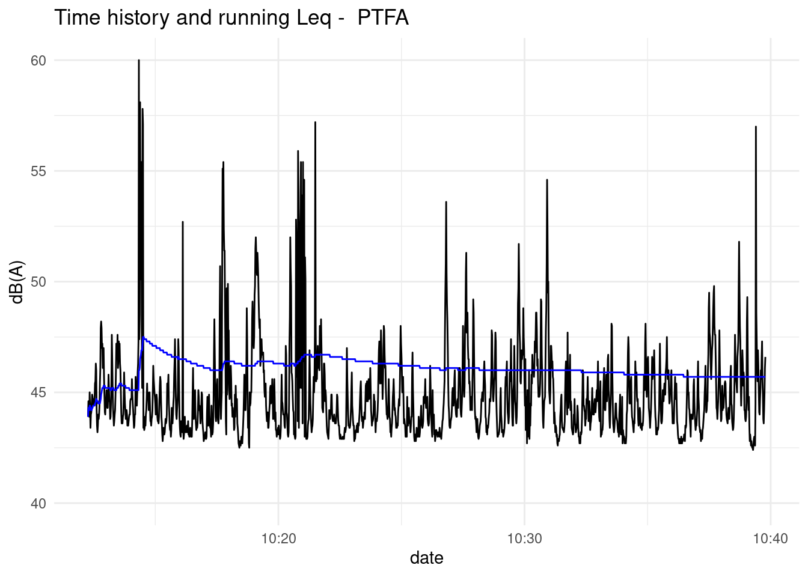
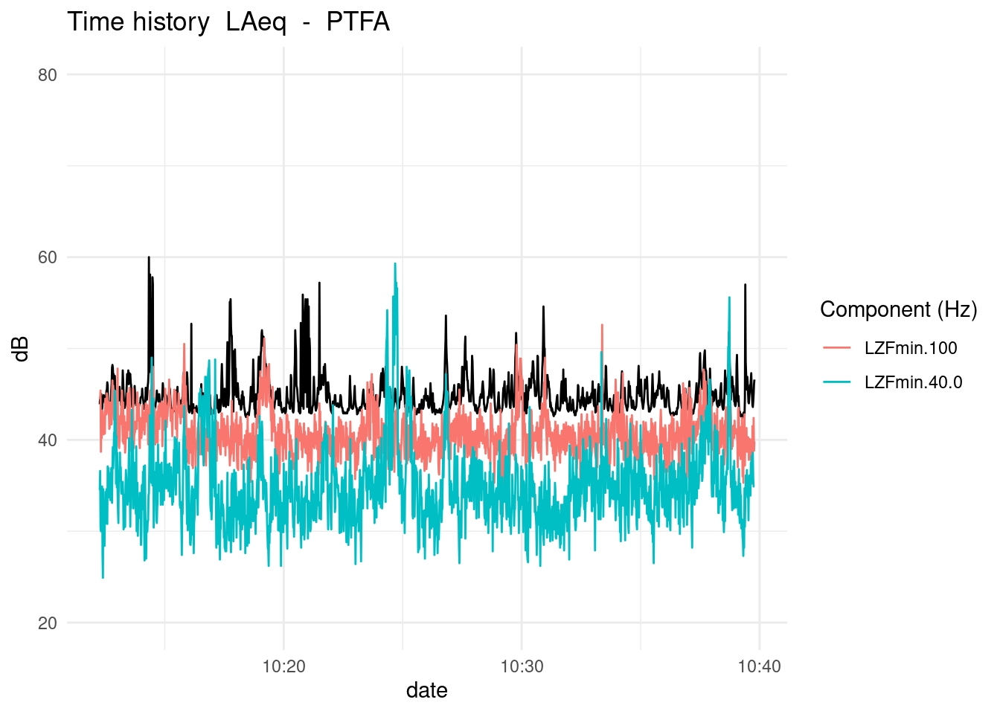
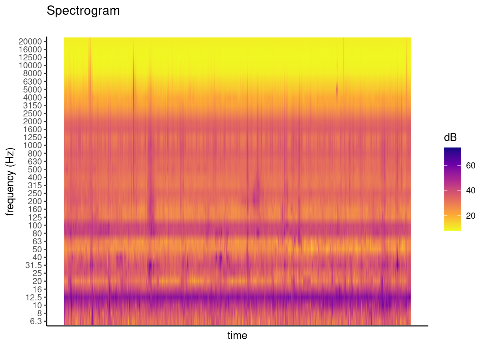
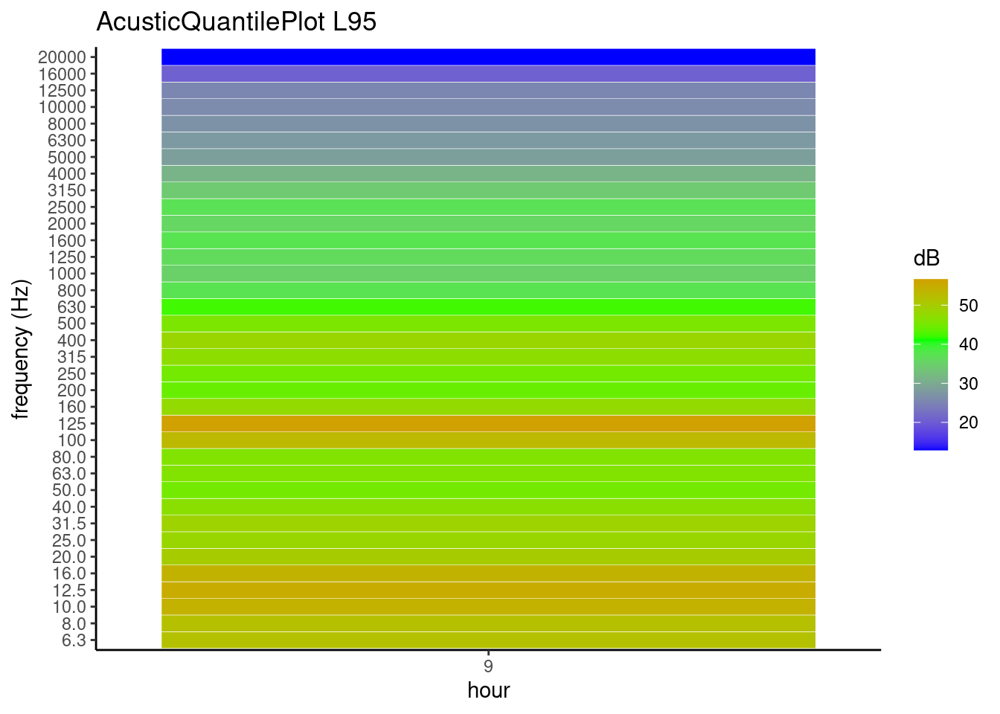
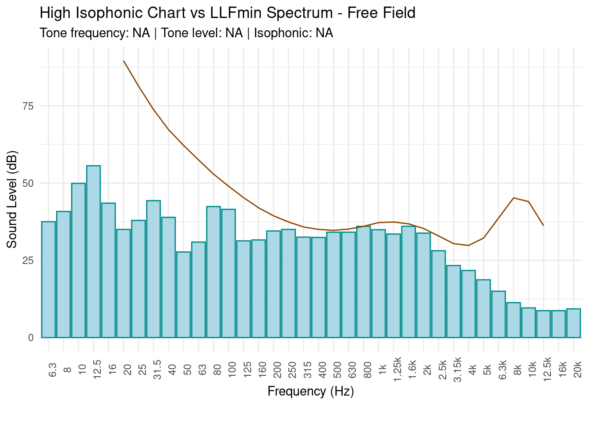
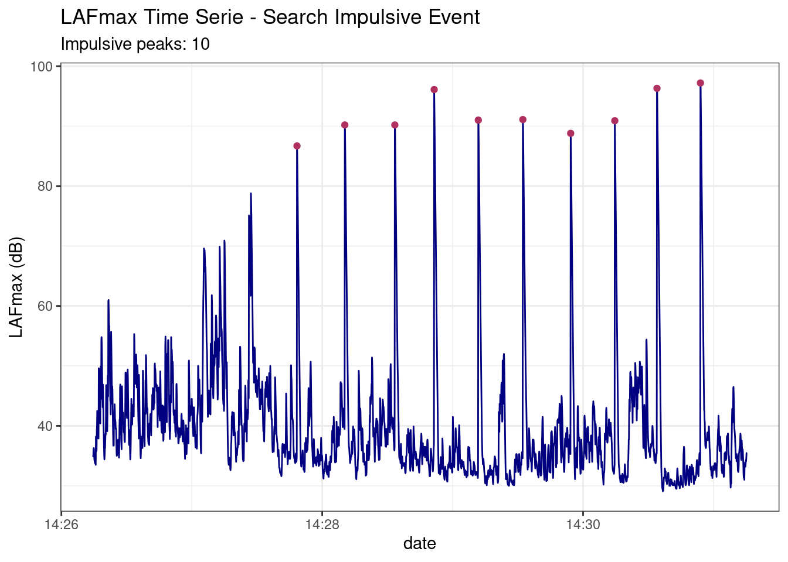

<!-- README.md is generated from README.Rmd. Please edit that file -->

# OpeNoise: noise pollution data analysis 

<!-- badges: start -->

[](https://cran.r-project.org/package=OpeNoise)

<!-- badges: end -->

### Installation

The development version can be installed from GitHub. Installation of
`OpeNoise` from GitHub is easy using the `devtools` package.

``` r
# install.packages("devtools")
devtools::install_github("Arpapiemonte/openoise-analysis")
```

### Introdution

This tutorial explains how to use the OpeNoise library. It works on
acoustic data acquired with sound level meters instrument. Input dataset
format is showed in internal examples that you can access them with the
*data()* function.

``` r
library(OpeNoise)

data("PTFA")

head(PTFA)[1:3, 1:6]
#>                  date LAeq LZFmin.6.3 LZFmin.8.0 LZFmin.10.0 LZFmin.12.5
#> 2 2022-03-07 10:12:16 43.9       31.6       34.7        59.9        74.1
#> 3 2022-03-07 10:12:17 44.6       33.7       43.9        59.6        58.9
#> 4 2022-03-07 10:12:18 44.5       46.0       52.2        51.3        57.2
```

### Acoustic summary calculation:

#### Energetic average

Function calculate energetic average of vector of values in dB.
*RoundTo* function round value at 0.5.

``` r
energetic.mean(PTFA$LAeq)
#> [1] 45.7
```

``` r

x <- energetic.mean(PTFA$LAeq)

RoundTo(x, 0.5)
#> [1] 45.5
```

#### Energetic average weighted

Function calculate energetic average weighted of vector’s values in dB
respect to vector’s time like string in format “HH:MM:SS”

``` r
energetic_w.mean(c(55.2, 88.6), c("03:22:52", "08:55:33"))
#> [1] 87.2
```

#### Acoustic percentile

Function return reverse percentile of un vector’s values.

``` r
AcuPercentile(PTFA$LAeq)
#>     L1     L5    L10    L50    L90    L95    L99 
#> 53.747 48.600 47.200 44.400 43.100 43.000 42.700
```

``` r

RoundTo(AcuPercentile(PTFA$LAeq), 0.5)
#>   L1   L5  L10  L50  L90  L95  L99 
#> 53.5 48.5 47.0 44.5 43.0 43.0 42.5
```

#### Day and night acoustic percentiles calculate

``` r
data("exampleHourlyData")

AcuDNPercentile(df = exampleHourlyData,
                parameter = "leq",
                from = "5",
                to = "22",
                period = "night")[1:5]
#> [[1]]
#>     L1     L5    L10    L50    L90    L95    L99 
#> 72.767 72.235 70.940 69.550 51.950 51.420 50.204 
#> 
#> [[2]]
#>     L1     L5    L10    L50    L90    L95    L99 
#> 71.448 70.840 70.620 69.850 50.750 48.425 47.285 
#> 
#> [[3]]
#>     L1     L5    L10    L50    L90    L95    L99 
#> 71.843 71.615 71.060 69.550 52.250 50.770 48.794 
#> 
#> [[4]]
#>     L1     L5    L10    L50    L90    L95    L99 
#> 72.656 72.080 71.280 70.000 52.560 51.350 49.550 
#> 
#> [[5]]
#>     L1     L5    L10    L50    L90    L95    L99 
#> 70.770 70.650 70.500 69.600 51.450 49.575 48.795
```

#### Energetic hourly average

Function return energetic average with hourly aggregation.

``` r
HourlyEmean(PTFA, "LAeq", timeZone = "Europe/Rome")
#>            date LAeq
#> 1 2022-03-07 10 45.7
```

#### Time decomposition

function retun seconds from hour, minutes and seconds.

``` r
hour <- 5
minute <- 25
second <- 50
deco.time(hour, minute, second)
#> [1] "Time decomposition from hours, minutes and seconds to seconds:"
#> [1] 19550
```

#### holidays date (Gregorian calendar)

This is simple function using Gauss’algorithm to return holiday date in
according of Gregorian calendar.

``` r
HolidaysDate(2024)
#> [1] "2024-01-01" "2024-01-06" "2024-04-25" "2024-05-01" "2024-06-02"
#> [6] "2024-08-15" "2024-11-01" "2024-03-31" "2024-04-01"
```

#### Average day/night period (06:00/22:00 - 22:00/06:00)

Function return energetic average or simple average with aggregation day
(06:00/22:00) or night (22:00/06:00).

``` r
data("exampleHourlyData")

df_night <- avr.day.night(exampleHourlyData, variable = "leq", period = "night", 
              stat = "e_mean")

head(df_night, 5)
#>         DATA MEAN  MIN  MAX
#> 1 2020-12-11 56.1 46.9 60.3
#> 2 2020-12-12 54.9 46.5 60.0
#> 3 2020-12-13 56.5 46.3 61.5
#> 4 2020-12-14 56.5 48.4 61.3
#> 5 2020-12-15 56.9 48.6 62.4
```

``` r

df_day <- avr.day.night(exampleHourlyData, variable = "leq", period = "day", 
              stat = "e_mean")

head(df_day, 5)
#>         DATA MEAN  MIN  MAX
#> 1 2020-12-11 69.9 64.9 72.3
#> 2 2020-12-12 69.4 63.4 72.6
#> 3 2020-12-13 69.0 60.2 72.1
#> 4 2020-12-14 69.6 64.1 73.2
#> 5 2020-12-15 69.7 64.2 72.9
```

#### Lden calculation

This function return energetic average aggregate:

- *D_acu* (day 06:00/22:00)
- *D* (day 06:00/20:00)
- *E* (Evening 20:00/22:00)
- *N* (Night 22:00/06:00)
- *Lden* (is the level of noise day-evening-night and is an indicator
  correlated with the global nuisance produced by noise over the overall
  24 hours)

``` r
data("exampleHourlyData")

LdenCalculator(dataframe = exampleHourlyData, variable = "leq", type = "daily")
#> # A tibble: 81 × 6
#>    date       D_acu     D     E     N  Lden
#>    <fct>      <dbl> <dbl> <dbl> <dbl> <dbl>
#>  1 2020-12-11  69.9  70.4  66    NA    NA  
#>  2 2020-12-12  69.4  69.7  65.6  56.1  68.9
#>  3 2020-12-13  69    69.3  65.4  54.9  68.4
#>  4 2020-12-14  69.6  70    64.9  56.5  69.1
#>  5 2020-12-15  69.7  70.1  65.1  56.5  69.2
#>  6 2020-12-16  70.3  70.7  65.4  56.9  69.7
#>  7 2020-12-17  70.1  70.5  65.9  57.4  69.7
#>  8 2020-12-18  69.6  69.8  66.7  57.2  69.3
#>  9 2020-12-19  69.1  69.4  66.1  56.6  68.9
#> 10 2020-12-20  69.2  69.5  66.5  54.7  68.7
#> # ℹ 71 more rows
```

``` r

LdenCalculator(dataframe = exampleHourlyData, variable = "leq", type = "total")
#> # A tibble: 1 × 4
#>       D     E     N  Lden
#>   <dbl> <dbl> <dbl> <dbl>
#> 1  69.8  66.3  57.6  69.4
```

#### dbsum

Function calculate energetic sum or difference of values

``` r
dbsum(x = 55, y = 33, operator = 1)
#> [1] 55.02732
```

``` r
dbsum(x = c(55 , 66), y = c(45, 50), operator = 1)
#> [1] 55.41393 66.10774
```

``` r

dbsum(x = c(70 , 68), y = c(55, 66), operator = -1)
#> [1] 69.86045 63.67077
```

#### SELcalc

Function calculate SEL (single event level)

``` r
SELcalc(x = 66.8, t = 938)
#> [1] 96.52203
```

### Plot functions (time history and Running Leq, spectrogram, quantile plot)

``` r
PlotNoiseTimeHistory(df = PTFA, variable = "LAeq", mp = "PTFA", y_lim = c(40, 60))
```



*PlotNoiseTHcompare* function shows Leq’s time history with frequency
components

``` r
PlotNoiseTHcompare(df = PTFA, 
                   variable = "LAeq", 
                   listvar = c("LZFmin.100",
                               "LZFmin.40.0"),
                   mp = "PTFA", 
                   runleq = FALSE)
```



``` r
PlotSpectrogram(PTFA, coLs = c(3:38), plot_title = "Spectrogram")
```



*AcousticQuantilePlot* function plot acoustic quantile aggregate by hour

``` r
library(lubridate)

datasetI <- dataset_impulsive1
datasetH <- dfImpulsiveTrasform(datasetI)
datasetH$date <- ymd_hms(as.character(datasetH$date))

AcousticQuantilePlot(df = datasetH, Cols =c(3:38), Quantile =0.95,
                     TimeZone = "UTC")
```



### Search tone

This function search tonal components in acoustic measure in according
of Italian law.

``` r
search.tone(PTFA[, c(3:38)], statistic = energetic.mean, plot.tone = T)
```



### Impulsive finder

This function search impulsive events in acoustic measure

``` r
data("dataset_impulsive2")
results <- searchImpulse(dataset_impulsive2)
results$dfPeaks
#>    ymax xmax startPeak stopPeak                date cri1 cri2
#> 1  97.2 2795      2794     2818 2022-05-06 14:30:54    y    5
#> 2  96.3 2595      2594     2622 2022-05-06 14:30:34    y    5
#> 3  96.1 1570      1564     1591 2022-05-06 14:28:51    y    4
#> 4  91.1 1978      1977     2000 2022-05-06 14:29:32    y    5
#> 5  91.0 1773      1771     1794 2022-05-06 14:29:11    y    5
#> 6  90.9 2401      2397     2420 2022-05-06 14:30:14    y    4
#> 7  90.2 1159      1158     1183 2022-05-06 14:28:10    y    5
#> 8  90.2 1389      1387     1410 2022-05-06 14:28:33    y    5
#> 9  88.8 2198      2197     2218 2022-05-06 14:29:54    y    4
#> 10 86.7  939       936      959 2022-05-06 14:27:48    y    5
```

``` r
results$Plot
```



#### Transform dataset from 100 ms data acquisition to 1 s data acquisition

``` r
data("dataset_impulsive2")
head(dataset_impulsive2, 3)[, 1:5]
#>                      date LAeq LASmax  LAF LAFmax
#> 2 2022-05-06 14:26:14.600 34.8   40.4 34.5   34.8
#> 3 2022-05-06 14:26:14.700 35.0   40.1 34.6   35.1
#> 4 2022-05-06 14:26:14.800 37.0   39.8 35.7   36.2
```

``` r
dfT <- dfImpulsiveTrasform(dfImpulsive = dataset_impulsive2, 
                           statistic = energetic.mean)
head(dfT, 3)[, 1:5]
#>                    date LAeq LZeq.6.3 LZeq.8.0 LZeq.10.0
#> 1 2022-05-06 14:26:14.6 34.8     29.4     37.5      43.7
#> 2 2022-05-06 14:26:14.7 35.0     31.5     34.9      38.5
#> 3 2022-05-06 14:26:14.8 37.0     28.2     37.1      35.2
```

### Calculation of the intrusiveness index

``` r
library(OpeNoise)
library(lubridate)

data("dataset_impulsive1")
data("dfBW")

# dataset handling
df_Imp_sec <- dfImpulsiveTrasform(dataset_impulsive1,
                                  statistic = energetic.mean)
df_Imp_sec$date <- ymd_hms(df_Imp_sec$date, tz = "Europe/Rome")

# extraction of frequency bands from the dataset
freqDF <- df_Imp_sec[, grep("LZeq\\.", names(df_Imp_sec))]

################################################################################
#                  INTRUSIVENESS INDEX CALCULATION FUNCTION
################################################################################
dfa <- freqDF # Environmental dataset simulation
dfr <- freqDF

# Residual dataset simulation by subtracting 4 from dfa
dfr[c(5,8,12,15), ] <- dfr[c(5,8,12,15), ] - 4

BW <- dfBW$BW # bandwidth

# application of the function
IntrusiveIndex(dfa, dfr, BW)
#> [1] "10 Intrusivity Index is negligible"
```
