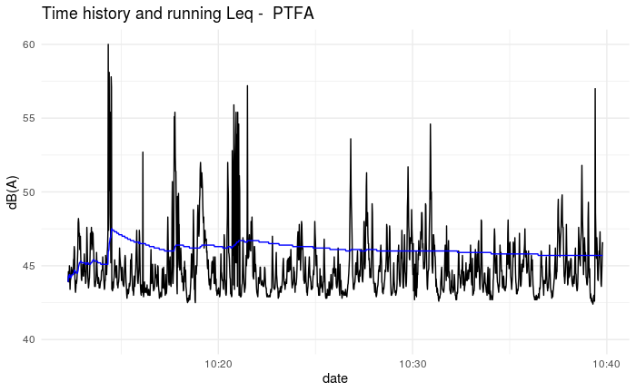
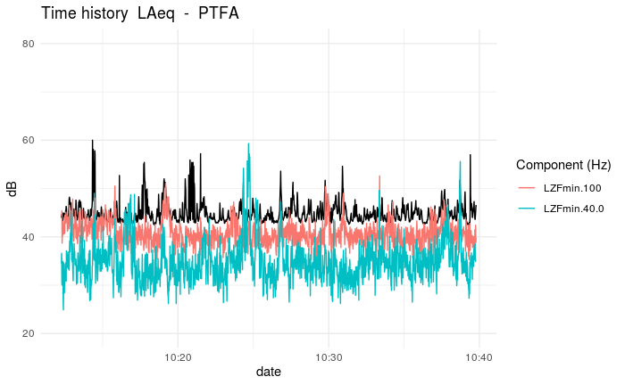
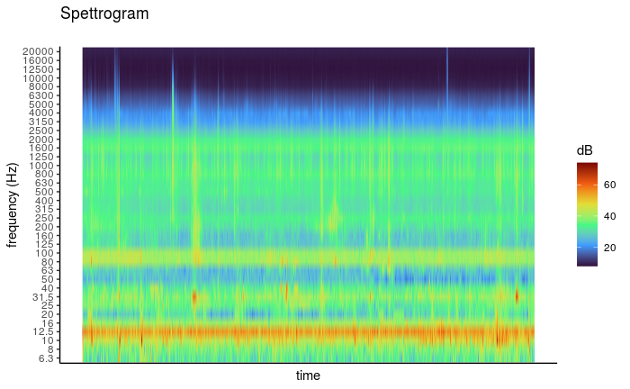
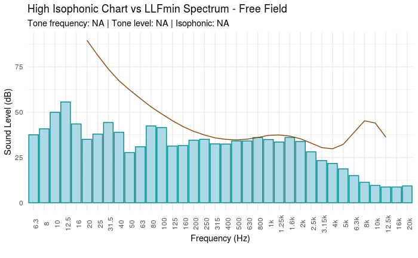
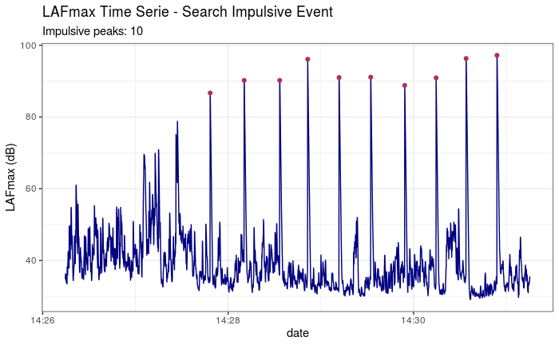

```{r, echo=FALSE}
htmltools::img(src =  "hex-OpeNoise.png", 
               alt = 'logo', 
               style = 'position:absolute; top:0; right:0; padding:10px; width: 100px; height: 118px')
```

```{r, include = FALSE}
knitr::opts_chunk$set(
  collapse = TRUE,
  comment = "#>"
)
knitr::opts_chunk$set(dev = "png", dev.args = list(type = "cairo-png"))
```
# Introdution

The tutorial explains how to use the OpeNoise library. 
It works on acoustic data acquired with sound level meters instrument. 
Input dataset format is showed in internal examples that you can access them 
with the *data()* function.

```{r}
library(OpeNoise)

data("PTFA")

head(PTFA)[1:3, 1:6]

```

# Acoustic summary calculation 

## Energetic average
Function calculate energetic average of vector of values in dB. 
*RoundTo* function round value at 0.5.

```{r}
energetic.mean(PTFA$LAeq)

x <- energetic.mean(PTFA$LAeq)

RoundTo(x, 0.5)
```

## Energetic average weighted
Function calculate energetic average weighted of vector's values in dB respect to
vector's time like string in format "HH:MM:SS"

```{r}
energetic_w.mean(c(55.2, 88.6), c("03:22:52", "08:55:33"))
```

## Acoustic percentile

Function return reverse percentile of un vector's values.

```{r}
AcuPercentile(PTFA$LAeq)

RoundTo(AcuPercentile(PTFA$LAeq), 0.5)
```
##  Energetic hourly average

Function return energetic average with hourly aggregation.

```{r}
HourlyEmean(PTFA, "LAeq", timeZone = "Europe/Rome")
```

##  Time decomposition

function retun seconds from hour, minutes and seconds.

```{r}
hour <- 5
minute <- 25
second <- 50
deco.time(hour, minute, second)
```

##  holidays date (Gregorian calendar)
This is simple function using Gauss'algorithm to return holiday 
date respect Gregorian calendar.
```{r}
HolidaysDate(2022)
```
## Average day/night period (06:00/21:00 - 22:00/05:00)

Function return energetic average or simple average with aggregation 
day (06:00/21:00) or night (22:00/05:00).

```{r, warning=FALSE}
data("exampleHourlyData")

df_night <- avr.day.night(exampleHourlyData, variable = "leq", period = "night", 
              stat = "e_mean")

head(df_night, 5)

df_day <- avr.day.night(exampleHourlyData, variable = "leq", period = "day", 
              stat = "e_mean")

head(df_day, 5)
```

## Lden calculation

This function return energetic average aggregate:

- *D_acu* (day 06:00/21:00) 
- *D*     (day 06:00/20:00)
- *E*     (Evening 20:00/22:00)
- *N*     (Night 22:00/06:00)
- *Lden*  (is the level of noise day-evening-night and is an indicator 
correlated with the global nuisance produced by noise over the overall 24 hours)

```{r}
data("exampleHourlyData")

LdenCalculator(dataframe = exampleHourlyData, variable = "leq", type = "daily")

LdenCalculator(dataframe = exampleHourlyData, variable = "leq", type = "total")
```


# Plot functions (time histrory and Running Leq, spectrogram)

```{r, fig.show='hide'}
PlotNoiseTimeHistory(df = PTFA, mp = "PTFA", y_lim = c(40, 60))
```

```{r, echo=FALSE}

```

*PlotNoiseTHcompare* function shows Leq's time history with frequency components

```{r, fig.show='hide'}
PlotNoiseTHcompare(df = PTFA, 
                   variable = "LAeq", 
                   listvar = c("LZFmin.100",
                               "LZFmin.40.0"),
                   mp = "PTFA", 
                   runleq = FALSE)
```

```{r, echo=FALSE}

```

```{r, fig.show='hide'}
PlotSpectrogram(PTFA, coLs = c(3:38), plot_title = "Spectrogram")
```

```{r, echo=FALSE}

```

# Search tone

This function..........

```{r, fig.show='hide', warning=FALSE}
search.tone(PTFA[, c(3:38)], statistic = energetic.mean, plot.tone = T)
```

```{r, echo=FALSE}

```

# Impulsive finder

This function.....

```{r, warning=FALSE}
data("dataset_impulsive2")
results <- searchImpulse(dataset_impulsive2)
results$dfPeaks
```

```{r, echo=FALSE}

```

## Transform dataset from 100 ms data acquisition to 1 s data acquisition

```{r}
data("dataset_impulsive2")
head(dataset_impulsive2, 3)[, 1:5]
dfT <- dfImpulsiveTrasform(dfImpulsive = dataset_impulsive2, 
                           statistic = energetic.mean)
head(dfT, 3)[, 1:5]
```


